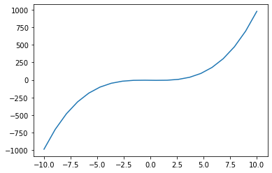
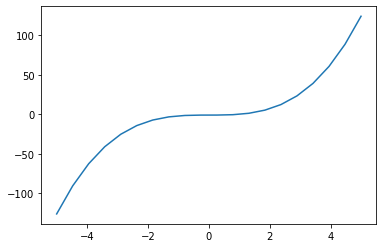
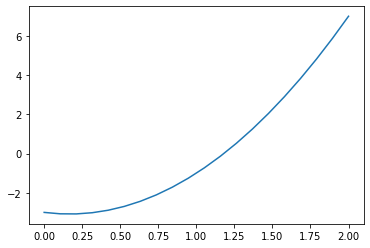

# bisection  二分法求解方程

## 二分法求解方程

二分法是一种求解方程 $ f(x) = 0 $ 的解的一种方法。

假设函数 $ f(x) $ 在区间 $ [a,b] $ 上连续，并且 $ f(a)*f(b)<0 $,此时就可以用二分法求解。

## 求解伪代码：
1. $ a_1 = a; $ &nbsp; $ b_1 = b $ ;
2. 计算中点 $ p_1 = \frac{(a_1+b_1)}2 $
3. 如果: $ f(p_1) = 0 $ ,那么方程的解为 $ x=p_1 $ ，终止
4. 如果: $ f(p_1) <> 0 $ 
     - 如果: $ f(p_1) * f(a_1)> 0 $,则： $ a_1=p_1;b_1=b_1 $
     - 如果: $ f(p_1) * f(a_1)< 0 $,则： $ a_1=a_1;b_1=p_1 $

重复上述步骤2到4，直到满足误差，停止迭代。

## 收敛
$ |p_n-p|<=\frac1{2^n}(b-a) $ 是第n次迭代的结果，p为真是解。


## 案例 
--求解：方程 $ 3x^2-x-3 = 0 $在区间 $ [0,2] $
--并显示其曲线

$$ f(x) = 3x^2-x-3  ;  $$

$$ f(0) = -3 ; $$
$$ f(2) = 7 ; $$ 
$$ f(\frac{0+2}2) = f(1) = -3 ; $$ 

## 代码
[bisection.py]{..\src\arithmetic_analysis\bisection.py}


```python
"""
Prepare
   1. sys.path 中增加 TheAlgorithms\src 子模块
   2. import matplotlib.pyplot，用于绘图使用 
   3. import numpy 用于区间分界
"""
import  matplotlib.pyplot as plt
import numpy as np
import sys
sys.path.append('E:\dev\AI\TheAlgorithms\src')

```

**安例一** <br>
求解：$ f(x) = x^3 - 2x - 5 $ 在区间 $[-10,10]$ 中的解。


```python
from arithmetic_analysis.bisection import bisection,f 
"""
直接调用 bisection 中的 __main__ 内相关信息
其中 程序 自定义的默认 f(x) = x ** 3 - 2 * x - 5
"""
myFunction = f # 设定当前函数指定的function
a,b=-10,10      # 区间初始值
divPointAmt=20  # 区间间产生20个点
x=np.linspace(a,b,divPointAmt)# 区间间产生20个点
y=myFunction(x) # 设置 x,y 之间的函数关系
'''
绘制曲线
'''
plt.figure()
plt.plot(x,y)

print(bisection(myFunction, a, b)) # 显示方程的解
```

    2.0945515483617783
    


    

    


**案例 二** <br>
求曲线：$ f(x) = x^2 -4x+3 $ 在区间 $[4,1000] $ 中与Y轴的交叉点。

```python
"""
调用 自定义 lambda 函数
"""
myFunction = lambda x: x ** 3  - 1 # 设定当前函数指定的function
a,b=-5,5      # 区间初始值
divPointAmt=20  # 区间间产生20个点
x=np.linspace(a,b,divPointAmt)# 区间间产生20个点
y=myFunction(x) # 设置 x,y 之间的函数关系
'''
绘制曲线
'''
plt.figure()
plt.plot(x,y)

print(bisection(theFunction, a, b)) # 显示方程的解

# print (bisection(lambda x: x ** 3 - 1, -5, 5))
```

    1.0000000149011612
    


    

    


**案例 三** <br>
求解：$ 3x^2-x-3 = 0 $在区间 $ [0,2] $ 中的解。


```python
"""
调用 自定义 myFunction 函数
"""

def myFunction(x: float) -> float:
    return 3*(x**2) - x - 3

a,b=0,2      # 区间初始值
divPointAmt=20  # 区间间产生20个点
x=np.linspace(a,b,divPointAmt)# 区间间产生20个点
y=myFunction(x) # 设置 x,y 之间的函数关系
'''
绘制曲线
'''
plt.figure()
plt.plot(x,y)

print(bisection(myFunction, a, b)) # 显示方程的解
```

    1.1804603934288025
    


    

    


```python

```
