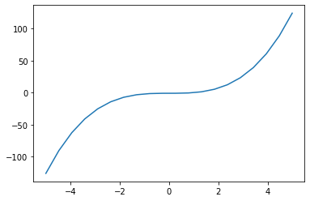
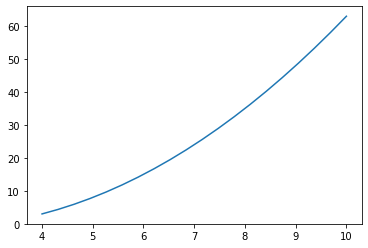
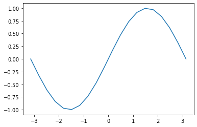

# intersection  交叉点

## 概述
函数求解其曲线在一定区间 $ [a,b] $ 中与Y轴相交点；<br>
即 $ f(x)=0 $ 在一定区间 $ [a,b] $ 中 的解。

## 示例
1. 求函数 $ x^3-1 $ 在 $ [-5,5] $ 与 Y  轴的相交点
2. 求函数 $ x^2-4x+3 $ 在$ [4,1000] $ 与 Y 轴的相交点

## 代码
[intersection.py]{..\src\arithmetic_analysis\intersection.py}


```python
"""
Prepare
   1. sys.path 中增加 TheAlgorithms\src 子模块
   2. import matplotlib.pyplot，用于绘图使用 
   3. import numpy 用于区间分界
"""
import  matplotlib.pyplot as plt
import numpy as np
import sys
sys.path.append('E:\dev\AI\TheAlgorithms\src')

```

**案例一** <br>
求函数 $ x^3-1 $ 在 $ [-5,5] $ 与 Y  轴的相交点


```python
from arithmetic_analysis.intersection import intersection 
"""

"""
myFunction = lambda x: x ** 3  - 1 # 设定当前函数指定的function
a,b=-5,5      # 区间初始值
divPointAmt=20  # 区间间产生20个点
x=np.linspace(a,b,divPointAmt)# 区间间产生20个点
y=myFunction(x) # 设置 x,y 之间的函数关系
'''
绘制曲线
'''
plt.figure()
plt.plot(x,y)

print(intersection(myFunction, a, b)) # 显示交叉点
```

    0.9999999999954654
    


    

    


**案例二** <br>
求函数 $ x^2-4x+3 $ 在 $ [4,100] $ 与 Y  轴的相交点


```python
from arithmetic_analysis.intersection import intersection 
"""

"""
myFunction = lambda x: x ** 2 - 4 * x + 3 # 设定当前函数指定的function
a,b=4,1000      # 区间初始值
divPointAmt=20  # 区间间产生20个点
x=np.linspace(a,b,divPointAmt)# 区间间产生20个点
y=myFunction(x) # 设置 x,y 之间的函数关系
'''
绘制曲线
'''
plt.figure()
plt.plot(x,y)

print(intersection(myFunction, a, b)) # 显示交叉点
```

    3.0000000000000373
    


    

    


**案例三** <br>
求函数 $ \sin(x) $ 在 $ [-\pi,\pi] $ 与 Y  轴的相交点 

`[X]` 曲线坐标轴未居中，有待改进


```python
from arithmetic_analysis.intersection import intersection 

"""

"""
myFunction = np.sin # 设定当前函数指定的function
"""
 myFunction = math.sin 会出现异常：TypeError: only length-1 arrays can be converted to Python scalars
 原因为： 不能直接应用 math 库里的东西到 ndarray 上,得用numpy中的函数。如np.exp
"""
a,b=-np.pi,np.pi      # 区间初始值
divPointAmt=20  # 区间间产生20个点
x=np.linspace(a,b,divPointAmt)# 区间间产生20个点
y=myFunction(x) # 设置 x,y 之间的函数关系
'''
绘制曲线
'''
plt.figure()
plt.plot(x,y)

# print(intersection(myFunction, a, b)) # 显示交叉点
```


    [<matplotlib.lines.Line2D at 0x20c002cbe80>]


    

    

