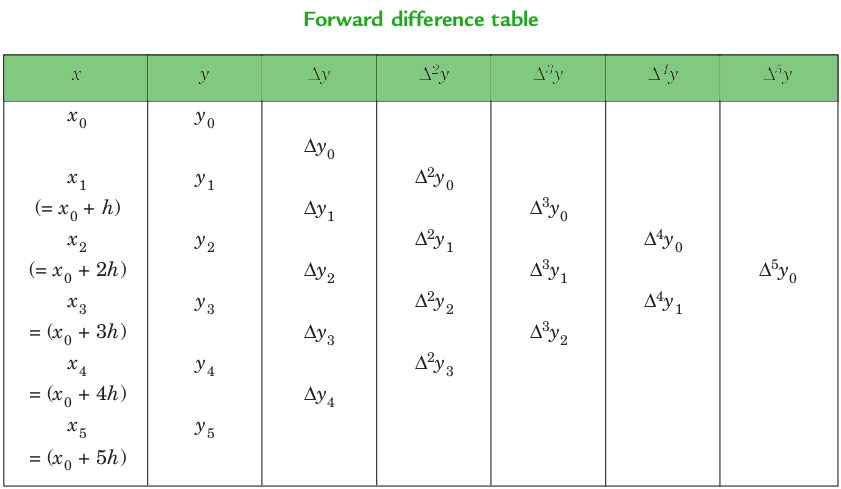
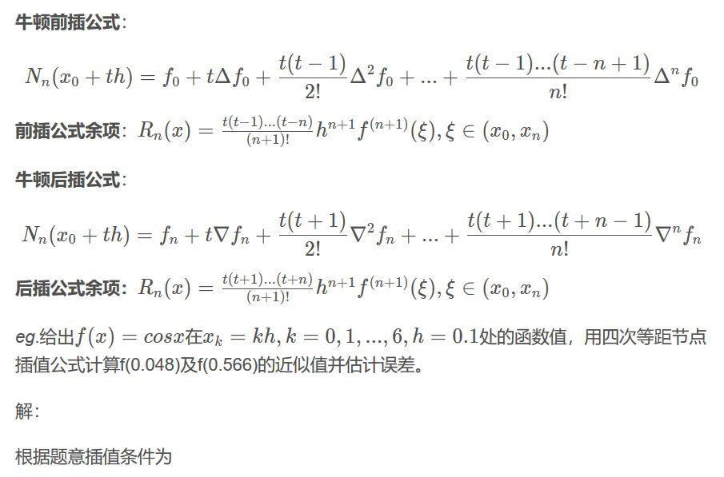

# newton_forward_interpolation  牛顿向前插值法

参考： https://zhuanlan.zhihu.com/p/66793653 <br>
      https://www.geeksforgeeks.org/newton-forward-backward-interpolation/

插值是对自变量的任意中间值估计函数值的技术，而计算给定范围外的函数值的过程称为外推。

正向差值:$y_1-y_0、y_2-y_1、y_3-y_2、\cdots、y_n-y_{n - 1} $ 分别用$ d_{y0}、d_{y1}、d_{y2}、\cdots、d_{y{(n-1)}}$ 表示，称为第一次正向差值。 因此，第一个正向差异是:  
$$ \Delta Y_r = Y_{r + 1} -Y_{r} $$ 
前向插值表如图所示：



公式：

NEWTON’S GREGORY FORWARD INTERPOLATION FORMULA : 
$$ f(a+hu)=f(a)+u\Delta f(a)+\frac{u\left ( u-1 \right )}{2!}\Delta ^{2}f(a)+...+\frac{u\left ( u-1 \right )\left ( u-2 \right )...\left ( u-n+1 \right )}{n!}\Delta ^{n}f(a)  $$  
这个公式对于插值f(x)在给定值集合的开始附近的值特别有用。 h是$ u=\frac{(x - a)} h $ 的区间，这里a是第一项  



## 代码
[newton_forward_interpolation.py]{..\src\arithmetic_analysis\newton_forward_interpolation.py}


```python
"""
Prepare
   1. sys.path 中增加 TheAlgorithms\src 子模块
"""
import sys
sys.path.append('E:\dev\AI\TheAlgorithms\src')

```

**安例一** <br>
NEWTON’S GREGORY FORWARD INTERPOLATION FORMULA : 
$$ f(a+hu)=f(a)+u\Delta f(a)+\frac{u\left ( u-1 \right )}{2!}\Delta ^{2}f(a)+...+\frac{u\left ( u-1 \right )\left ( u-2 \right )...\left ( u-n+1 \right )}{n!}\Delta ^{n}f(a)  $$  
这个公式对于插值f(x)在给定值集合的开始附近的值特别有用。 h是$ u=\frac{(x - a)} h $ 的区间，这里a是第一项  

# for calculating u value
def ucal(u: float, p: int) -> float:


```python
from arithmetic_analysis.newton_forward_interpolation import  ucal
"""
"""
'''
ucal(1, 2)    #    0
ucal(1.1, 2)  #    0.11000000000000011
ucal(1.2, 2)  #    0.23999999999999994
'''
print (ucal(1, 2))
print (ucal(1.1, 2) )
print (ucal(1.2, 2) )


```

    0
    0.11000000000000011
    0.23999999999999994
    

已知： <br>
sin45 =  0.7071  <br>
sin50 =  0.7660  <br>
sin55 =  0.8192  <br>
sin60 = 0.8660   <br>
求 sin52  <br>


```python
from arithmetic_analysis.newton_forward_interpolation import  ucal

# calculating factorial of given number n
def fact(n):
    f = 1
    for i in range(2, n + 1):
        f *= i
    return f
 
# Driver Code
# Number of values given
n = 4
x = [ 45, 50, 55, 60 ]
     
# y[][] is used for difference table
# with y[][0] used for input
y = [[0 for i in range(n)]
        for j in range(n)]
y[0][0] = 0.7071
y[1][0] = 0.7660
y[2][0] = 0.8192
y[3][0] = 0.8660
 
# Calculating the forward difference table
for i in range(1, n):
    for j in range(n - i):
        y[j][i] = y[j + 1][i - 1] - y[j][i - 1]
 
# Displaying the forward difference table
for i in range(n):
    print(x[i], end = "\t")
    for j in range(n - i):
        print(y[i][j], end = "\t")
    print("")
 
# Value to interpolate at
value = 52
 
# initializing u and sum
sum = y[0][0]
u = (value - x[0]) / (x[1] - x[0])
for i in range(1,n):
    sum = sum + (ucal(u, i) * y[0][i]) / fact(i)
 
print("\nValue at", value,
      "is", round(sum, 6))
```

    45	0.7071	0.05890000000000006	-0.005700000000000038	-0.0007000000000000339	
    50	0.766	0.053200000000000025	-0.006400000000000072	
    55	0.8192	0.04679999999999995	
    60	0.866	
    
    Value at 52 is 0.788003
    


```python

```
