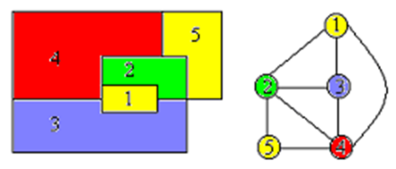

# coloring 图着色

图着色也称为“m着色问题” , 由最多 m 种颜色的给定图着色组成 ,
使相邻的顶点不被赋予相同的颜色  

图着色问题（Graph Coloring Problem, GCP） 又称着色问题，是最著名的NP-完全问题之一。道路着色问题（Road Coloring Problem）是图论中最著名的猜想之一。




数学定义：给定一个无向图G=（V, E），其中V为顶点集合，E为边集合，图着色问题即为将V分为K个颜色组，每个组形成一个独立集，即其中没有相邻的顶点。其优化版本是希望获得最小的K值。
## 简介
图的m-着色判定问题——给定无向连通图G和m种不同的颜色。用这些颜色为图G的各顶点着色，每个顶点着一种颜色，是否有一种着色法使G中任意相邻的2个顶点着不同颜色? <br>

图的m-着色优化问题——若一个图最少需要m种颜色才能使图中任意相邻的2个顶点着不同颜色，则称这个数m为该图的色数。求一个图的最小色数 m 的问题称为m-着色优化问题。<br>  

## 路线着色问题
G是一个有限有向图并且G的每个顶点的出度都是k。G的一个同步着色满足以下两个条件：<br>
- 1)G的每个顶点有且只有一条出边被染成了1到k之间的某种颜色；
- 2)G的每个顶点都对应一种走法，不管你从哪里出发，按该走法走，最后都结束在该顶点。<br>

有向图G存在同步着色的必要条件是G是强连通而且是非周期的。一个有向图是非周期的是指该图中包含的所有环的长度没有大于1的公约数。路线着色定理这两个条件(强连通和是非周期)也是充分的。也就是说,有向图G存在同步着色当且仅当G是强连通而且是非周期的。<br>

道路着色问题（Road Coloring Problem）是图论中最著名的猜想之一。通俗的说，这个猜想认为，可以绘制一张“万能地图”，指导人们到达某一目的地，不管他们原来在什么位置。这个猜想最近被以色列数学家艾夫拉汉· 特雷特曼(Avraham Trahtman)在2007年9月证明。<br>

特雷特曼在数学上的这一成果极为令人瞩目，英国《独立报》为此事专门发表了一篇题为“身无分文的移民成了数学超级明星”的文章，给予了高度的评价。<br>

以色列人也为特雷特曼取得的成就感到无比的骄傲。特拉维夫电视台中断了正常的节目播放，以第一时间发布了这一重大消息，连中东其他国家的主流媒体也作了大篇幅的相关报道。<br>
得知特雷特曼解决这一难题的消息后，多年从事路线着色问题研究的加拿大数学家乔尔·弗里德曼说，“路线着色问题的解决令数学共同体非常兴奋。”读过特雷特曼论文的中国数学家和语言学家周海中教授认为，特雷特曼的数学知识非常渊博，解题方法十分巧妙，这一谜题得到破解，无疑是数学史上的一个华彩乐章。<br>
## 算法
点着色问题有简单的时间复杂度为O(3^n)的算法，即设f(S)表示集合的色数，则。
## 算法描述
$ color[n] $存储n个顶点的着色方案，可以选择的颜色为1到m。<br>
当t=1时，对当前第t个顶点开始着色：若$ t>n $，则已求得一个解，输出着色方案即可。否则，依次对顶点t着色 $ 1-m $， 若t与所有其它相邻顶点无颜色冲突，则继续为下一顶点着色；否则，回溯，测试下一颜色。

## 范例：

第一行，一个整数n(1 < n < 100)，表示参加考试的人数。 　<br>
第二行，一个整数m，表示接下来有m行数据  <br>
以下m行每行的格式为：两个整数a，b，用空格分开 (1<=a,b<=n) 表示第a个人与第b个人认识。 <br>
输出格式一行一个整数，表示最少分几个考场 <br>

## 代码
[coloring.py]{..\src\backtracking\coloring.py}


```python
"""
Prepare
   1. sys.path 中增加 TheAlgorithms\src 子模块

"""
import sys
sys.path.append('E:\dev\AI\TheAlgorithms\src')

```

## 案例一： 
```
    >>> neighbours = [0,1,0,1,0]
    >>> colored_vertices = [0, 2, 1, 2, 0]

    >>> color = 1
    >>> valid_coloring(neighbours, colored_vertices, color)
    True

    >>> color = 2
    >>> valid_coloring(neighbours, colored_vertices, color)
    False
 ```


```python
from backtracking.coloring import valid_coloring
"""
"""
neighbours = [0,1,0,1,0]
colored_vertices = [0, 2, 1, 2, 0]

color = 1
valid_coloring(neighbours, colored_vertices, color)

```


    True


## 案例二： 
    >>> graph = [[0, 1, 0, 0, 0],
    ...          [1, 0, 1, 0, 1],
    ...          [0, 1, 0, 1, 0],
    ...          [0, 1, 1, 0, 0],
    ...          [0, 1, 0, 0, 0]]

    >>> max_colors = 3
    >>> color(graph, max_colors)
    [0, 1, 0, 2, 0]
```


```python
from backtracking.coloring import color
"""
"""
graph = [[0, 1, 0, 0, 0],
         [1, 0, 1, 0, 1],
         [0, 1, 0, 1, 0],
         [0, 1, 1, 0, 0],
        [0, 1, 0, 0, 0]]
max_colors = 3
color(graph, max_colors)
```


    [0, 1, 0, 2, 0]


```python

```
