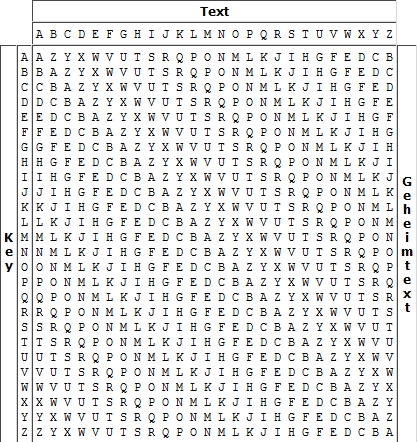

# beaufort_cipher  博福特密码(古典密码)

## 概念

博福特密码，是一种类似于维吉尼亚密码的替代密码，由弗朗西斯·蒲福（Francis Beaufort）发明。它最知名的应用是M-209密码机。博福特密码属于对等加密，即加密演算法与解密演算法相同

博福特密码是按mod q减法运算的一种周期代替密码，其博福特密码表如下



与维吉尼亚密码表相比，就第二列开始的字母排序不一致

示例

例如，明文的第一个字母为D，则先在表格中找到第D列。由于密钥的第一个字母为F，于是D列从上往下找到F。这一F对应的行号为C，因而C便是密文的第一个字母。以此类推可以得到密文。以下便是一个密钥为FORTIFICATION时的例子：<br>
Key: FORTIFICATION  <br>
明文：DEFENDTHEEASTWALLOFTHECASTLE <br>
密钥：FORTIFICATIONFORTIFICATIONFO <br>
密文：CKMPVCPVWPIWUJOGIUAPVWRIWUUK <br>


## 算法
  
## 代码
[beaufort_cipher.py]{..\src\ciphers\beaufort_cipher.py}


```python
"""
Prepare
   1. sys.path 中增加 TheAlgorithms\src 子模块

"""
import sys
sys.path.append('E:\dev\AI\TheAlgorithms\src')

```

## 案例一： 
Key: FORTIFICATION  <br>
明文：DEFENDTHEEASTWALLOFTHECASTLE <br>
密钥：FORTIFICATIONFORTIFICATIONFO <br>
密文：CKMPVCPVWPIWUJOGIUAPVWRIWUUK <br>


```python
from ciphers.beaufort_cipher import generate_key,cipher_text,original_text
"""
    
"""
message = "DEFENDTHEEASTWALLOFTHECASTLE"
key = "FORTIFICATION"
key_new = generate_key(message, key)
# key_new = "FORTIFICATION"
s = cipher_text(message, key_new)
print(f"Encrypted Text = {s}")
print(f"Original Text = {original_text(s, key_new)}")

```

    Encrypted Text = YQOLFYLFELSEGRMUSGALFEJSEGGQ
    Original Text = DEFENDTHEEASTWALLOFTHECASTLE
    

## 案例二： 
注意：key_new = generate_key(message, key)
  与message ,key 有关


```python
from ciphers.beaufort_cipher import generate_key,cipher_text,original_text
"""
    
"""
message = "THE GERMAN ATTACK"
key = "SECRET"
key_new = generate_key(message, key)
s = cipher_text(message, key_new)
print(f"Encrypted Text = {s}")
print(f"Original Text = {original_text(s, key_new)}")
```

    Encrypted Text = BDC PAYUWL JPAIYI
    Original Text = THE GERMAN ATTACK
    


```python

```
