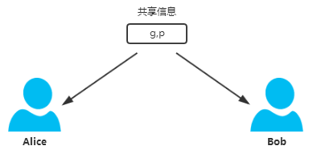
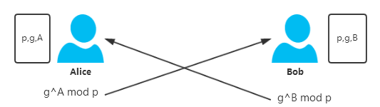
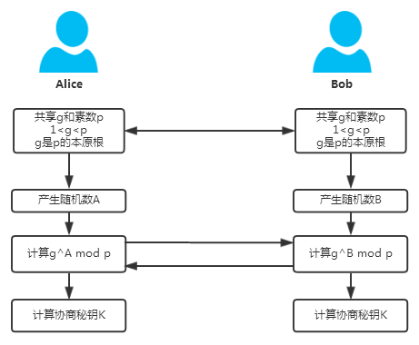
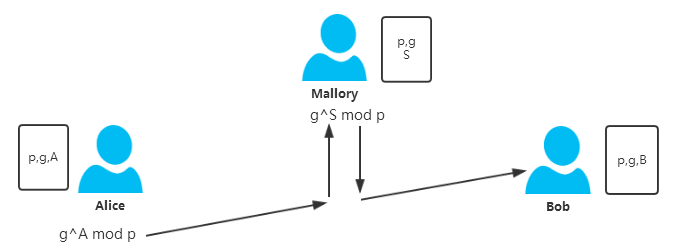
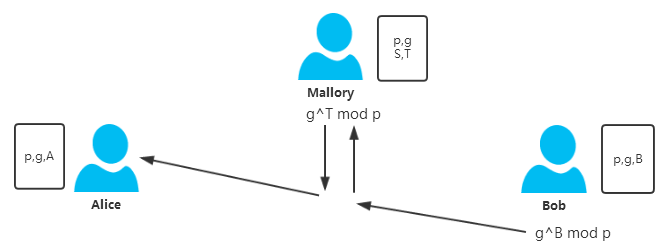

# Diffie-Hellman密钥协商算法

## 一、概述
Diffie-Hellman密钥协商算法主要解决秘钥配送问题，本身并非用来加密用的；该算法其背后有对应数学理论做支撑，简单来讲就是构造一个复杂的计算难题，使得对该问题的求解在现实的时间内无法快速有效的求解（computationally infeasible ）。

理解Diffie-Hellman密钥协商的原理并不困难，只需要一点数论方面的知识既可以理解，主要会用到简单的模算术运算、本原根、费马小定理、离散对数等基础数论的知识。在现代密码学中的基础数论知识梳理中已经对这些知识做了必要的总结。

 ## 二、从何而来
DH密钥协商算法在1976年在Whitfield Diffie和Martin Hellman两人合著的论文New Directions in Cryptography（Section Ⅲ PUBLIC KEY CRYPTOGRAPHY）中被作为一种公开秘钥分发系统(public key distribution system)被提出来。原文的叙述过程比较简单，但基本阐述了算法的原理以及其可行性。

在该论文中实际上提出了一些在当时很有创新性的思想。原论文重点讨论两个话题：

（1）在公网通道上如何进行安全的秘钥分派。

（2）认证（可以细分为消息认证和用户认证）。

为了解决第一个问题，原文提出两种方法：公钥加密系统(public key cryptosystem)和秘钥分发系统(public key distribution system)。对于公钥加密系统，原文只是勾画了一种比较抽象的公钥加密系统的概念模型，重点是加解密采用不同的秘钥，并总结了该系统应该满足的一些特性，相当于是一种思想实验，并没有给出具体的算法实现途径，但这在当时应该来说已经足够吸引人。后来RSA三人组（Ron Rivest、Adi Shamir 和 Leonard Adleman）受此启发，经过许多轮失败的尝试后，于第二年在论文A Method for Obtaining Digital Signatures and Public-Key Cryptosystems中提出了切实可行且很具体的公钥加密算法--RSA公钥加密算法。而对于秘钥分发系统，就是本文的DH秘钥协商算法。

为了解决第二个问题，原文通过单向函数（one-way function）来解决，这就是单向认证的问题。另外作者还讨论了这些密码学问题之间的关联性以及如何相互转化。比如一个安全的密码系统（可以防御明文攻击）可以用来生成一个的单向函数、公钥加密系统可以用来作为单向认证、陷门密码系统可以用来生成一个公钥加密系统。数学难题的计算复杂度被当成一种保障密码学安全问题的有效工具被利用起来，这一重要思想贯穿现代密码学的许多加密算法。

## 三、算法流程及原理
按照惯例，以Alice和Bob这两个密码学中的网红为角色，述阐DH算法的流程。

假设Alice需要与Bob协商一个秘钥（秘钥本质上就是一个比特序列，从计算的角度看就是一个大数）。

$ g^A \ mod \ p = Y_a $

1）首先Alice与Bob共享一个素数p以及该素数p的本原根g（geneator），当然这里有 $ 2 \leq g \leq {p−1} $。这两个数是可以不经过加密地由一方发送到另一方，至于谁发送给并不重要，其结果只要保证双方都得知p和g即可。





2）然后Alice产生一个私有的随机数A，满足 $ 1⩽A⩽p−1 $ ，然后计算 $ g^A \ mod \ p = Y_a $，将结果$ Y_a $通过公网发送给Bob；与此同时，Bob也产生一个私有的随机数B，满足 $ 1⩽B⩽p−1 $ ，计算 $ g^B \ mod \ p = Y_b $，将结果 $ Y_b $通过公网发送给Alice。



3）此时Alice知道的信息有 $ p,g,A,Y_a $，其中数字A是Alice私有的，只有她自己知道，别人不可能知道，其他三个信息都是别人有可能知道的；Bob知道的信息有$ p,g,B,Y_b $，其中数字B是Bob私有的，只有他自己知道，别人不可能知道，其他都是别人有可能知道的。

到目前为止，Alice和Bob之间的秘钥协商结束。

Alice通过计算$ K_a = {(Y_b)}^A \ mod \ p $ 得到秘钥 $ K_a $，同理，Bob通过计算$ K_b = {(Y_a)}^B \ mod \ p $得到秘钥Kb，此时可以证明，必然满足$ K_a=K_b $。因此双方经过协商后得到了相同的秘钥，达成秘钥协商的目的。

 证明：

对于Alice有：
$$ K_a={(Y_b)}^A \ mod \ p = {(g^B \ mod \ p)}^A \ mod \ p = g^{B×A} \ mod \ p $$
对于Bob有：
$$ K_b={(Y_a)}^B \ mod \ p = {(g^A \ mod \ p)}^B \ mod \ p = g^{A×B} \ mod \ p $$
可见，Alice和Bob生成秘钥时其实是进行相同的运算过程，因此必然有 $K_a=K_b $。"相同的运算过程"是双方能够进行秘钥协商的本质原因，类似的利用椭圆曲线进行秘钥协商也是与之相同的原理。

更严密地考虑，A和B不应该选择 $ p−1 $，也就是说只能在集合{1,2,3,...,p−2}中选择。这是因为如果选择p−1，那么由费马小定理可知，情况就退化成了 $ g^{p−1} ≡ 1(mod \ p) $ 的情况，对秘钥协商的机密性构成威胁。

所以总结起来，整个流程串起来大概就是这样：



那么窃听者Eve能否破解秘钥呢？首先要知道Eve能够得知哪些信息，显然Eve能够窃听到的信息只能有 $ p,g,Y_a,Y_b $ ，现在的问题是Eve能够通过以上信息计算出 $ K_a $或者$K_b $吗？要计算 $ K_a $ 或者 $ K_b $需要知道 $ A $或者 $ B $。

以计算 $ A $ 为例，Eve能根据条件 $ g^A \ mod \ p = Y_a $ 计算出A吗？实际上当p是大质数的时候，这是相当困难的，这就是离散对数问题。实际上在论文发表的当时，计算该问题的最有效的算法的时间复杂度大约是 $ O(\sqrt(p) $。也正是求解该问题在计算上的困难程度保证了DH算法的安全性。如果能够找到对数时间复杂度的算法，那么该算法即容易被攻破。

## 四、一个实例
1）假设Alice和Bob共享的 $ p $和 $ g $ 分别是 $ p=17,g=3 $，显然这里 $ g=3 $ 是$ p=17 $ 的一个本原根，实际上 $ 3,5,6,7,10,11,12,14 $ 都是17的本原根。

2）然后Alice选定一个私有数字，假设 $ A=15 $，计算 $ Y_a = 315 \ mod \ 17=14348907 \ mod \ 17 = 6 $，将$ 6 $ 发送给Bob；同时Bob也选定一个私有的数字，假设 $ B=13 $，计算 $ Y_a = 313 \ mod \ 17 = 1594323 \ mod \ 17 = 12 $，将 $ 12 $ 发送给Alice。

3）Alice计算秘钥 $ K_a=1215 \ mod \ 17=2147483647 \ mod \ 17 = 8 $，Bob计算秘钥$ K_b = 613 \ mod \ 17 = 2147483647 \ mod \ 17 = 8 $ 。双方经过协商后，8最终成为双方的协商的秘钥。

实际上，当指数和模数的位数都比较大的时候，存在一种快速计算幂取模的算法叫做“反复平方算法”，实现取来也比较简单，在算法导论中第三十一章有相应的解释。

## 五、存在的问题
 是否DH秘钥协商算法就一定安全呢？应该说也不是，因为存在一种伪装者攻击（或者称为中间人攻击）能够对这种秘钥协商算法构成威胁。

假设秘钥协商过程中，在Alice和Bob中间有一个称为Mallory的主动攻击者，他能够截获Alice和Bob的消息并伪造假消息，考虑如下情况。

1）Alice和Bob已经共享一个素数 $ p $ 及其该素数 $ p $ 的本原根 $ g $，当然Mallory监听到报文也得知了这两个消息。

2）此时Alice计算 $ Y_a = g^A \ mod \ p $，然而在将Ya发送给Bob的过程中被Mallory拦截，Mallory自己选定一个随机数 $ S $，计算 $ Y_{sb} = g^S \ mod \ p $，然后将$ Y_{sb} $发送给了Bob。



3）同时Bob计算Yb=gBmodp，然而在将Yb发送给Alice的过程中被Mallory拦截，Mallory自己选定一个随机数 $ T $，计算$ Y_{ta} = g^T \ mod \ p $，然后将$ Y_{ta} $发送给了Alice。



由于通讯消息被替换，Alice计算出的秘钥实际上是Alice和Mallory之间协商秘钥：$ K_{am}=g^{A×T} \ mod \ p $；Bob计算出的秘钥实际上是Bob与Mallory之间协商的秘钥：$ K_{bm} = g^{B×S} \ mod \ p $。如果之后Alice和Bob用他们计算出的秘钥加密任何信息，Mallory截获之后都能够解密得到明文，而且Mallory完全可以伪装成Alice或者Bob给对方发消息。

## 六、References <br>
1、New Directions in Cryptography  <br>
2、密码编码学与网络安全原理与实践  <br>
3、图解密码技术  <br>
转载请注明原文出处：http://www.cnblogs.com/qcblog/p/9016704.html  <br>

## 代码
[diffie_hellman.py]{..\src\ciphers\diffie_hellman.py}


```python
"""
Prepare
   1. sys.path 中增加 TheAlgorithms\src 子模块

"""
import sys
sys.path.append('E:\dev\AI\TheAlgorithms\src')

```

## 案例一： 
1. 建立对象 DiffieHellman  <br>
2. 生成私钥                 <br>
3. 依据私钥生成对外端公布的公钥  <br>
4. 生成共享密钥  <br>
4.1. 仅采用对方公钥生成共享密钥 <br>
4.2. 依据自身私钥，对端公钥生成对外端公布的公钥 <br>

5. 验证 和自生成共享密钥 数据的一致性


```python
from ciphers.diffie_hellman import DiffieHellman
    
"""
"""
alice = DiffieHellman()   # 建立对象 DiffieHellman
bob = DiffieHellman()  # 建立对象 DiffieHellman

alice_private = alice.get_private_key()   # 生成私钥
alice_public = alice.generate_public_key()  # 依据私钥生成对外端公布的公钥

bob_private = bob.get_private_key()  # 生成私钥
bob_public = bob.generate_public_key()  # 依据私钥生成对外端公布的公钥

# generating shared key using the DH object
alice_shared = alice.generate_shared_key(bob_public)  # 仅采用对方公钥生成共享密钥
bob_shared = bob.generate_shared_key(alice_public)   # 仅采用对方公钥生成共享密钥

# assert alice_shared == bob_shared

print('alice''s Message :');
print(f'alice : {alice}');    
print(f'alice_private : {alice_private}'); # 私钥
print(f'alice_public : {alice_public}');  # 公钥
print(f'alice_shared : {alice_shared}');  # 共享密钥

print('bob''s Message :');
print(f'bob : {bob}');
print(f'bob_private : {bob_private}');  # 私钥
print(f'bob_public : {bob_public}');  # 公钥
print(f'bob_shared : {bob_shared}');# 共享密钥

print('shared Message :');
print(f'alice_shared =bob_shared ? : {alice_shared == bob_shared}');

# generating shared key using static methods
alice_shared = DiffieHellman.generate_shared_key_static(
    alice_private, bob_public
)   # 依据自身私钥，对端公钥生成对外端公布的公钥
bob_shared = DiffieHellman.generate_shared_key_static(
    bob_private, alice_public
)   # 依据自身私钥，对端公钥生成对外端公布的公钥
# assert alice_shared == bob_shared

print('generate_shared_key_static:')
print(f'alice_shared : {alice_shared}');
print(f'bob_shared : {bob_shared}');
print('shared Message :');
print(f'alice_shared =bob_shared ? : {alice_shared == bob_shared}');


```

    alices Message :
    alice : <ciphers.diffie_hellman.DiffieHellman object at 0x00000281AA092DF0>
    alice_private : 13375e79f4aff21ffbca91709fc4e8cbdee875c2727b8fa9f7d1b73a34c0956d
    alice_public : 4400c0a0040e071e0595a0ca0c3f7a5d3bca9020e840c19d20a33265100adcf4db9fc615c7388090a1aa015a44875ca0e9b32f526693ca65bb2543b16147297488acfb8e47bd2f560b63d2e808af5a5994e26f9d10851abb15f61a7d89654f7c63c8d835b0e848fe043cc6db946481a1402dfd6c4dc043345d576a08f7ed2ad3142b7f214ffe72301a00b1ff6077758d1856c0559bc9c7fe85b5ea844d5e89a4566b0b4f9cae6847f2dd9f86f220bb743721efde6433d824812fbe46f028b1085c79a5a237925378e543f0633ad606912460ae673a6cf49a1490464790cd472f7e720ac485dae95a14cb0d04d0d44be75b9506fe6f98dd6ad37ce17bc99a22b1
    alice_shared : 81f3ebcd0ccc1f48f080930e86a8596736ed9333ca6fb29773e0912baf9df5e6
    bobs Message :
    bob : <ciphers.diffie_hellman.DiffieHellman object at 0x00000281A9A66C70>
    bob_private : f9cb4099e4548bdb8ff9a87127f7b15cf17eaec01d21d8fca3f94d425fa00834
    bob_public : 4360fcea08a9fa032b98bc7713046bf6394155fcf59d584c0261d8f732e072113e87f13bebb11a4ef87b952ab072310ba23e0598ec488b5777974465abca80304dbd9d2f7ffa165bf4654ab9b933de89b7b8df58207841340c325d2812b8eba5e244da983eebf04bd0c2734fa720510876335879a56ab241fcf2d1bb80d72444e040de10ca963b8b22ae67727ff44ae57f2ed36e3051f1b82cf3d9c1bc510a785437bcb2685e41f868551321ae215cbff8690e6fc68a8caa388e29551be4190bf3b7dc85d1fcb9979264c7b1499590576300e4cfbc263785c45091ea8ea0eaeffd87fcb3aff6afc3cd6a5bd741f66f777336934ef648ef578673a93b4603dc11
    bob_shared : 81f3ebcd0ccc1f48f080930e86a8596736ed9333ca6fb29773e0912baf9df5e6
    shared Message :
    alice_shared =bob_shared ? : True
    generate_shared_key_static:
    alice_shared : 81f3ebcd0ccc1f48f080930e86a8596736ed9333ca6fb29773e0912baf9df5e6
    bob_shared : 81f3ebcd0ccc1f48f080930e86a8596736ed9333ca6fb29773e0912baf9df5e6
    shared Message :
    alice_shared =bob_shared ? : True
    
